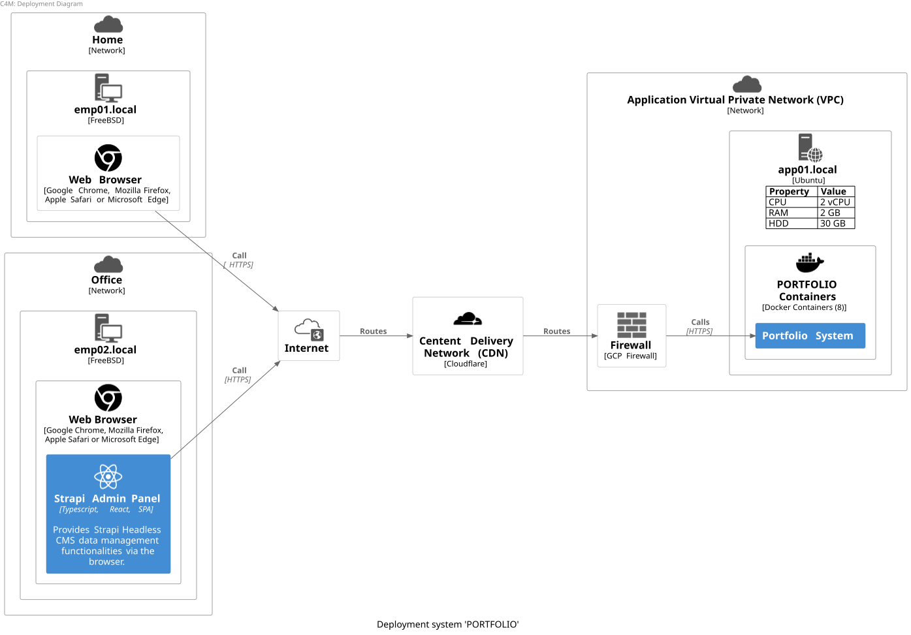
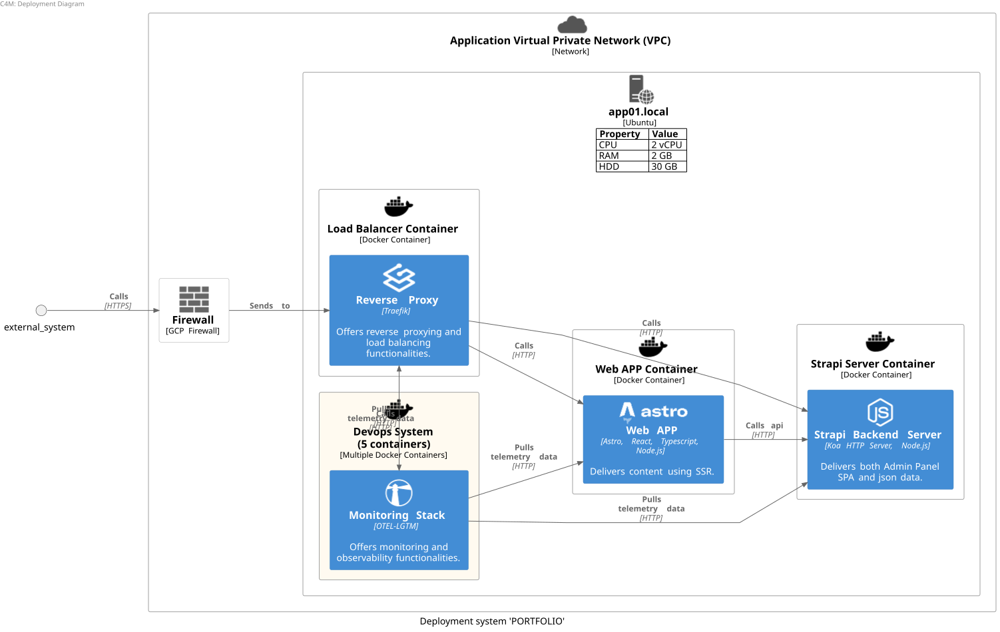
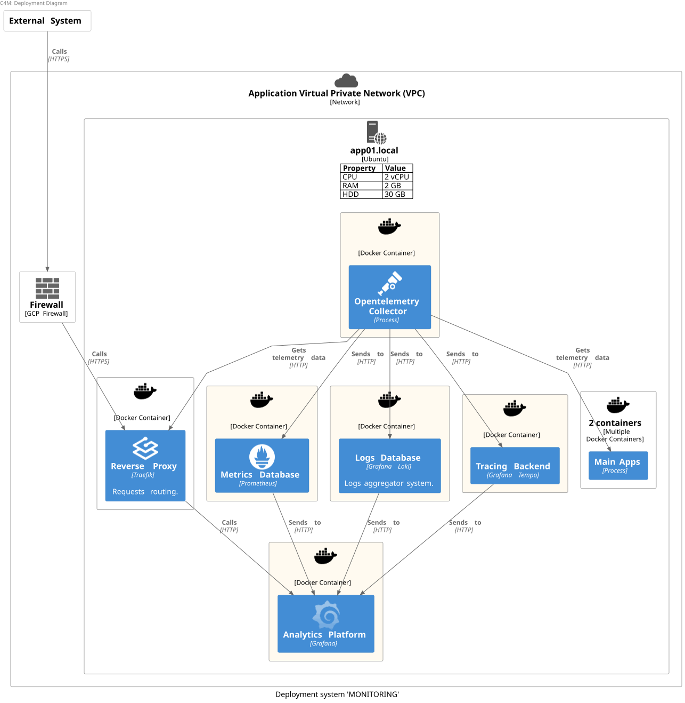
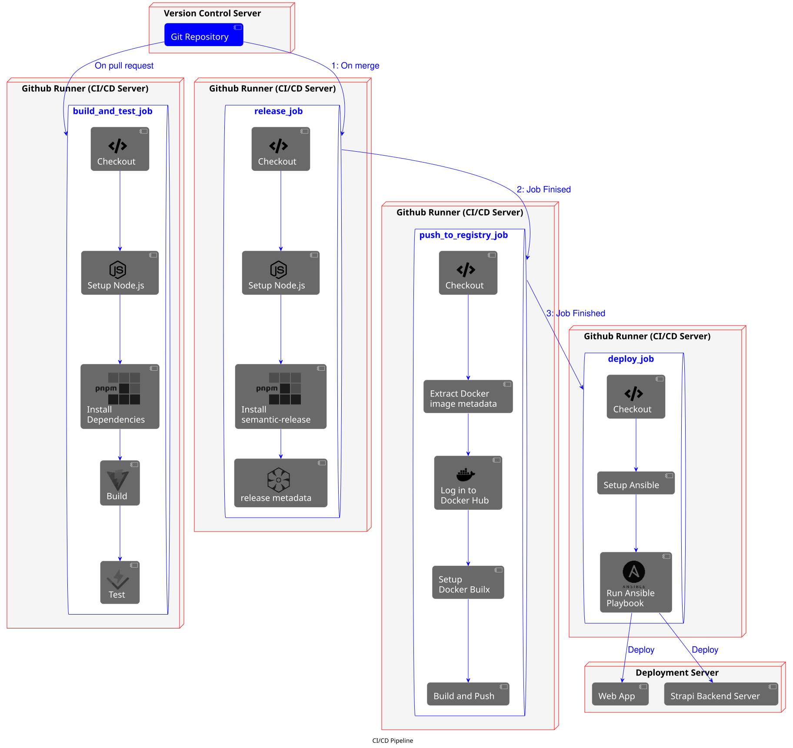

<br />


<!--  -->

## Table of contents
- [Using the project](#using-the-project)
- [Local Development Environment Setup](#local-development-environment-setup)
- [Architecture](#architecture)
- [DevOps](#devops)
- [How the project was setup](#how-the-project-was-setup)

## Using the project
- Clone the project
```bash
git clone https://github.com/ax-iq/new-portfolio.git
```
- Working with multi-root workspaces in VScode

If using VScode as a code editor,
click on the file ***new-portfolio.code-workspace*** and then click on the blue button that will appear with the label ***Open Workspace***.

## Local Development Environment Setup

Dev Containers (recommended)

- System requirements:

    - Windows: [Docker Desktop](https://www.docker.com/products/docker-desktop/) 2.0+ and  [WSL 2 back-end](https://docs.docker.com/desktop/features/wsl/)

    - macOS: [Docker Desktop](https://www.docker.com/products/docker-desktop/) 2.0+

    - Linux: [Docker CE/EE 18.06+](https://docs.docker.com/get-started/get-docker/#supported-platforms) and Docker Compose 1.21+ ()

- If using VSCode

    - Install VSCode Dev Containers extention
    - Launch the dev container

    Press **F1** to bring up the Command Palette and type in **Dev Containers** for a full list of commands.

    Select **Build Container** or **Rebuild Container** in order to build and start the dev container.

-  If not using VSCode:

    - [Install Node.js using nvm](https://nodejs.org/en/download)

    - Install devcontainers cli 

    ```bash
    npm install -g @devcontainers/cli
    ```

    - Run the dev container

    ```bash
    devcontainer up --workspace-folder ./
    ```

- Start development:

After starting the dev container:

- Create a file with the name ".env" by using the ".env.example" file as a guide.

- Then run the following command to start the project containers:
```bash
make start-dev
```

Visit the UIs:

- [Web App](https://frontend.localhost)  (https://frontend.localhost)

- [Strapi Admin Panel](https://backend.localhost)  (https://backend.localhost)

- [Reverse Proxy Dashboard](https://traefik.localhost) (https://traefik.localhost)

- [Grafana Dashboard](https://grafana.localhost) (https://traefik.localhost)

**Note:** 
- You will get a security warning in the browser. It is a normal behavior as we use a self-signed SSL certificate for local development.

In the browser, do: 

    Advanced > Proceed to ...

to continue.

- The browser may also block the images fetched from the backend service if using "localhost" as primary domain with http.


To **stop** the containers and **remove** the created docker volumes, run the following command:
```bash
make reset-dev
```

## Architecture
- Deployment Diagram








- [System Context Diagram](docs/diagrams/out/system_context_diagram/system_context_diagram.svg)


- [Container Diagram](docs/diagrams/out/container_diagram/container_diagram.svg)


- [Web App Components Diagram](docs/diagrams/out/web_app_component_diagram/web_app_component_diagram.svg)


- [Strapi Backend Server Component Diagram](docs/diagrams/out/strapi_backend_server_component_diagram/strapi_app_component_diagram.svg)


## DevOps

- CI/CD workflow


- Infrastructure provisioning workflow
- Infrastructure configuration workflow

### How the project was setup
[Go to Project Setup](docs/markdown/new_project_setup.md#project-setup)

