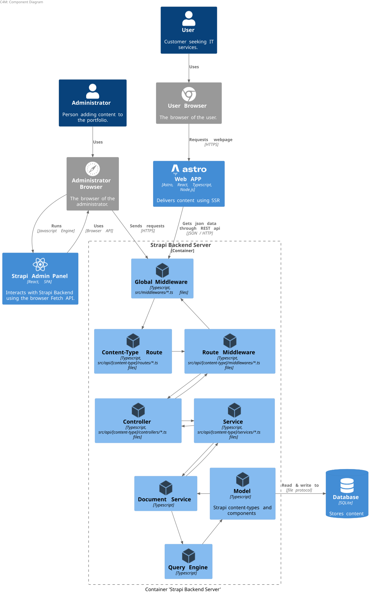

# BACKEND

## Usage
```bash
# To start the devlopment server, run:
make run
```

## Architecture
Strapi Backend Server Component Diagram:



## Starting a new project from scratch

- Install node.js v20

- Create the project

```bash
npx create-strapi@latest my-strapi-project
```
- Enable access behind a proxy

Allow the app to be accessed through http when deployed
behind a reverse proxy.

Inside the file **config/server.ts**, set the following at the same level as the "host" key.
```js
proxy: { koa: true },
```
If you do not set this and set the environment variable
*NODE_ENV=production*, you will get an error.

When *NODE_ENV=production*, it is assumed that the app will either be accessed through https or using a reverse proxy to access via http in which case the proxy setting should be enable as above.

- (Optional) Creating a middleware

To create a middleware run the following command and follow the instructions.
```bash
pnpm strapi generate
```

A middleware file will be generated with the location: *api/<content_type_name>/middlewares/<middleware_name>.ts*.


One use case of middlewares is to simplify URLs for accessing strapi data. In fact, instead of passing long query parameters inside an URL to access Strapi data, we can just expose a simple URL and on each request of the client, the server middleware modify the request with a **"Populate"** object before forwarding the request. See [Strapi blog](https://strapi.io/blog/route-based-middleware-to-handle-default-population-query-logic) about it.

- Adding distributed tracing support with OpenTelemetry

Add the the file **instrumentation.js** on the root of the project.

Modify the package.json file. Replace:
```json
"develop": "strapi develop"
```
with:
```json
"develop": "node -r ./instrumentation.js ./node_modules/@strapi/strapi/bin/strapi.js develop
```
This ensure that the Opentelemetry instrumentation runs before the server and thus enabling http tracing.

- Environment variables

Strapi requires a set of environment variables in production. Create a .env file on the root of the project (See [Strapi docs](https://docs.strapi.io/cms/configurations/environment#docusaurus_skipToContent_fallback).).

- Starting the dev sever

```bash
# Depending on the package manager used (npm, yarn, pnpm)
pnpm run develop
```

## Notes

- Node version

Strapi only support specific node.js version. Node v20 for example is supported.

- Populate Object

With Strapi V5 here is a Populate object sample:
```js
{
  pageZone: {
    on: {
      'block.experience-grid': { 
        populate: { 
          experiences: { 
            populate: {
              tags: {
                populate: {}
              },
              companyLogo: {
                populate: {},
                fields: ['alternativeText', 'name', 'url'],
              },
              image: {
                populate: {},
                fields: ['alternativeText', 'name', 'url'],
              },
              links: {
                populate: {},
              },
            }
          }
        } 
      }
    }
  }
}
```

Inside the object, do not use the following because it does not work:
```js
populate: true
```

Use this instead:
```js
populate: {}
```
