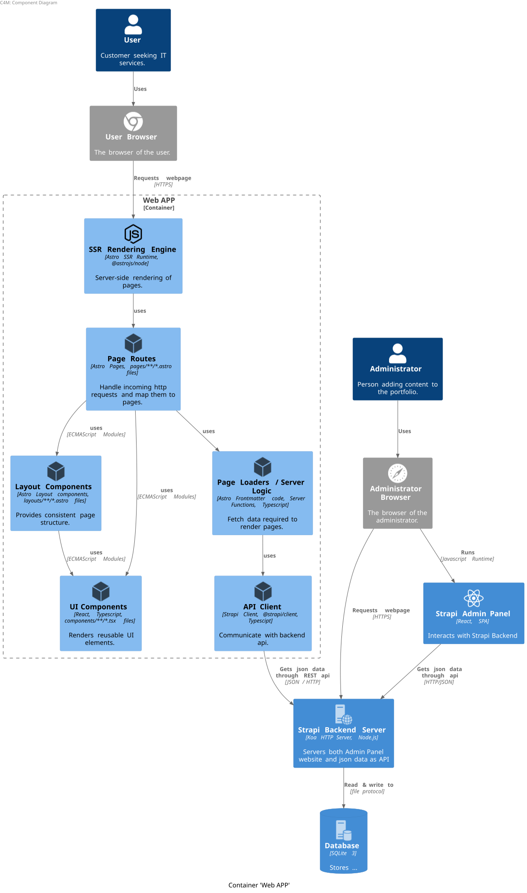

# FRONTEND


<!--  -->

**Note**: recommendation to use linux or WSL on windows

## Table of contents
- [Development Environment Setup](#development-environment-setup)
- [Usage](#usage)
- [Architecture](#architecture)
- [How to](#how-to)

## Development Environment Setup
Run the script: *scripts/setup-dev-environment.sh* to setup the development environment.
**Alternatively**, follow the below steps:
### 1. Install pnpm
```sh
curl -fsSL https://get.pnpm.io/install.sh | sh -
```

### 2. Manage multiple versions of Node
- Install NVM (Node Version Manager)
```sh
curl -o- https://raw.githubusercontent.com/nvm-sh/nvm/v0.40.1/install.sh | bash
```

- Install a specific version of Node
```sh
nvm install 23.7.0
```

- Set default node version
```sh
nvm alias default v23.7.0
# Alternatively you can set the node version each time
# you open a new shell:
# nvm use v23.7.0
```

## Usage
Make sure the **backend server is up** and running before.
To run the dev server, run the command:
```bash
make run
```

## Architecture

Astro App components diagram:




## How to
- Add a new language

    - Add the language svg image flag in *src/assets/flags* folder.

    - Update the file *src/utils/flags.ts* with the new flag.

    - Update the file *src/config/locales.ts* with the new language.

    - Update the *astro.config.mjs* file with the new language by modifying the **locales** object.

    - Update the *src/utils/i18n/ui.ts* file to add translations for the web page labels. Usage example:

    ```js
    ---
    import { getLangFromUrl } from "@/utils/i18n/getLangFromUrl";
    import { usesTranslations } from "@/utils/i18n/useTranslations";

    const lang = getLangFromUrl(Astro.url);
    const t = usesTranslations(lang);
    ---

    <div class="py-4">{t("page.skills")}</div>
    ```

- Add a new icon

Add the new icon name inside the file *src/utils/icons.ts* both in the import and the iconMap object.

- Add a new page
"welcome" example: Create a new file *pages/[locale]/welcome.astro*. The page is accessible via the url "http://localhost:<-port-number->/en/welcome" if locale=en (english).

- Create a new react component ("button" component example):
Create the file *src/components/atoms/Button/Button.tsx*. Add react code:
```js
export default Button() {
    return (
        <button type="button">Button Name</button>
    )
}
```

- Use a react component in an astro page
You can import react components in .astro pages. Example:
Inside the *pages/[locale]/welcome.astro* page:
```js
---
import Button from "@/components/atoms/Button/Button";
---

<html lang="en">
  <head>
    <title>Welcome Page</title>
  </head>
  <body>
    <h1>Welcome !</h1>
    // The React Button Component
    <Button />
  </body>
</html>

```

Note: In an Astro Page, this portion of the code:
```js
---
import Button from "@/components/atoms/Button/Button";
---
```
is called the frontmatter and it only runs at **build time** and **on the server** when using SSR (Server Side Rendering) and at build time only when using SSG (Static Site Generation).

To run javascript on the browser you need to add it under the script element:

```js
---
---
<div>
    // UI
</div>

<script>
    // Client side javascript goes here.
</script>
```

One of Astro goals is to ship minimal javascript to the browser. So by default, Astro renders every UI component to only HTML and CSS. You need to explicitly hydrate your react components in Astro Pages to make them work if your component contain client site javascript. Example:
```js
<MyReactComponent client:load />
```
If you just use:
```js
<MyReactComponent />
```
without the **client:load** the component will be static and not interactive.

- Add caching control

Example from [Astro docs](https://docs.astro.build/en/guides/on-demand-rendering/):
```js
---
export const prerender = false; // Not needed in 'server' mode

Astro.response.headers.set('Cache-Control', 'public, max-age=3600');
---
<html>
  <!-- Page here... -->
</html>
```
